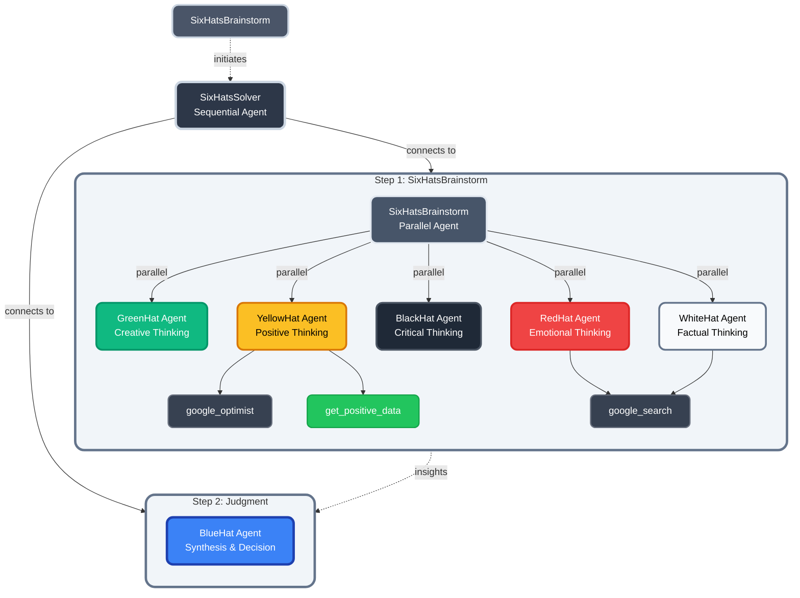

# Six Hats Solver <!-- omit in toc -->

 


## Executive Summary

The Six Hats Solver uses autonomous agents to replicate Edward de Bono’s structured thinking methodology. Each “hat” acts as a specialized cognitive module, enabling AI to provide deeper, more diverse, and more actionable insights than a single‑model approach. This system improves decision quality by combining critical reasoning, creativity, emotional awareness, and structured synthesis.

## Table of Contents

- [Executive Summary](#executive-summary)
- [Table of Contents](#table-of-contents)
- [Problem Statement](#problem-statement)
  - [Our Solution](#our-solution)
- [What is Six Thinking Hats?](#what-is-six-thinking-hats)
- [Installation \& Setup](#installation--setup)
  - [Prerequisites](#prerequisites)
  - [Clone the Repository](#clone-the-repository)
  - [Set Up Your Development Environment](#set-up-your-development-environment)
  - [PowerShell (Windows)](#powershell-windows)
  - [Linux / macOS (Bash)](#linux--macos-bash)
  - [Install the Project in Editable Mode](#install-the-project-in-editable-mode)
- [Running the Solver](#running-the-solver)
  - [1. Configure Environment Variables](#1-configure-environment-variables)
  - [2. Choose How You Want to Run the Application](#2-choose-how-you-want-to-run-the-application)
    - [**Option A — Run the Jupyter Notebook Demo**](#option-a--run-the-jupyter-notebook-demo)
    - [**Option B — Launch the ADK Web UI**](#option-b--launch-the-adk-web-ui)
    - [**Option C — Run in the Command Line**](#option-c--run-in-the-command-line)
- [What We Create: System Architecture Overview](#what-we-create-system-architecture-overview)
  - [**High‑Level Architecture**](#highlevel-architecture)
  - [**1. SixHatsBrainstorm (Entry Point)**](#1-sixhatsbrainstorm-entry-point)
  - [**2. SixHatsSolver (Sequential Controller Agent)**](#2-sixhatssolver-sequential-controller-agent)
  - [**3. Step 1 — Parallel Brainstorming**](#3-step-1--parallel-brainstorming)
  - [**4. Step 2 — Judgment \& Synthesis (Blue Hat)**](#4-step-2--judgment--synthesis-blue-hat)
  - [**Result**](#result)
- [Why Six Hats Works for AI](#why-six-hats-works-for-ai)
- [Demo: End-to-End Six Hats Analysis Example](#demo-end-to-end-six-hats-analysis-example)
  - [📝 **Input Prompt to SixHatsSolver**](#-input-prompt-to-sixhatssolver)
  - [⬜ **White Hat: Data \& Information**](#-white-hat-data--information)
  - [🟥 **Red Hat: Emotions \& Intuition**](#-red-hat-emotions--intuition)
  - [⬛ **Black Hat: Caution \& Critical Judgment**](#-black-hat-caution--critical-judgment)
  - [🟨 **Yellow Hat: Optimism \& Benefits**](#-yellow-hat-optimism--benefits)
  - [🟩 **Green Hat: Creativity \& Alternatives**](#-green-hat-creativity--alternatives)
  - [🟦 **Blue Hat: Final Synthesis \& Action Plan**](#-blue-hat-final-synthesis--action-plan)
- [Comparison: Single LLM vs. Six Hats Agentic System](#comparison-single-llm-vs-six-hats-agentic-system)
- [Key Standout Advantages of the Six Hats Solver](#key-standout-advantages-of-the-six-hats-solver)
  - [**1. Emotional Intelligence \& Change Management**](#1-emotional-intelligence--change-management)
  - [**2. Cognitive Rigor \& Bias Detection**](#2-cognitive-rigor--bias-detection)
  - [**3. Innovation Through Dedicated Creativity**](#3-innovation-through-dedicated-creativity)
- [How We Built It](#how-we-built-it)
- [Future Improvements](#future-improvements)
  - [**1. Dynamic Orchestration**](#1-dynamic-orchestration)
  - [**2. Sequential vs. Parallel Experiments**](#2-sequential-vs-parallel-experiments)
  - [**3. Human‑in‑the‑Loop Mode**](#3-humanintheloop-mode)


## Problem Statement

Organizations often find themselves stuck in circular debates, overwhelmed by bias and scattered thinking. The [Six Thinking Hats](https://en.wikipedia.org/wiki/Six_Thinking_Hats) method—originally developed by **Dr. Edward de Bono**, a pioneering figure in creative and parallel thinking—cuts through that chaos by bringing clarity, structure, and focused creativity to every discussion. However, despite its effectiveness, facilitating the process manually can be slow, inconsistent, and difficult to scale.

### Our Solution

Our solution is an AI-powered Six Hat Problem Solver. It uses autonomous agents to simulate each hat’s mindset, generating structured insights and aggregating them into comprehensive solutions. This approach reduces bias, improves efficiency, and ensures strict adherence to the methodology.

## What is Six Thinking Hats?

The Six Thinking Hats method was created by **Dr. Edward de Bono**, who pioneered the concept of *parallel thinking*. His work introduced a structured way for individuals and teams to think more clearly, creatively, and collaboratively.

The Six Thinking Hats is a parallel thinking process that helps teams move away from argument and towards a comprehensive view of a situation. By "wearing" different hats, we can separate ego from performance and focus on one mode of thinking at a time.

| Hat        |    | Perspective                | Description                                                                                                                                                           |
| ---------- | -- | -------------------------- | --------------------------------------------------------------------------------------------------------------------------------------------------------------------- |
| **White**  | ⬜  | **Facts & Information**    | Focuses on available data, facts, and what information is missing. It is neutral and objective, looking at the problem purely from an informational standpoint.       |
| **Red**    | 🟥 | **Feelings & Intuition**   | Represents emotions, hunches, and gut feelings. It allows for the expression of fears, likes, and dislikes without the need for logical justification or explanation. |
| **Black**  | ⬛  | **Caution & Critical**     | Focuses on risk assessment, identifying potential problems, and why something might not work. It is the hat of judgment and caution, vital for avoiding mistakes.     |
| **Yellow** | 🟨 | **Benefits & Optimism**    | Symbolizes brightness and positivity. It explores the benefits, value, and optimistic viewpoints. It looks for logical reasons why an idea will work.                 |
| **Green**  | 🟩 | **Creativity & New Ideas** | Focuses on creativity, alternatives, possibilities, and new concepts. It is used to generate new ideas and move beyond known solutions.                               |
| **Blue**   | 🟦 | **Process & Control**      | The "Hat of Hats" used for managing the thinking process itself. It ensures the guidelines are observed, organizes the other hats, and synthesizes the outcomes.      |

## Installation & Setup

This section provides everything you need to install, configure, and prepare the Six Hats Solver for local development.

Follow the steps below to get the project running on your machine in a developer‑friendly workflow commonly used across GitHub projects.

### Prerequisites

Before beginning, ensure the following tools are installed:

| Tool           | Minimum Version | Purpose                              | Check Command          |
| -------------- | --------------- | ------------------------------------ | ---------------------- |
| **Python**     | ≥ 3.10          | Required to run the project          | `python --version`     |
| **Git**        | (optional)      | Used to clone the repository         | `git --version`        |
| **Virtualenv** | (recommended)   | Creates isolated Python environments | `python -m venv .venv` |

### Clone the Repository

Clone the repository using SSH or HTTPS:

```bash
# Navigate to the directory where you want the project
cd C:/Git

# Clone with SSH
git clone git@github.com:praveenprabharavindran/agents-intensive-capstone-2025.git

# Or clone with HTTPS
git clone https://github.com/praveenprabharavindran/agents-intensive-capstone-2025.git
```

### Set Up Your Development Environment

Follow the instructions for your operating system to create and activate a virtual environment.

### PowerShell (Windows)

```powershell
# (Optional) Remove an old virtual environment
# Remove-Item -Recurse -Force .venv

# Create a new virtual environment
python -m venv .venv

# Activate the environment
.venv\Scripts\Activate.ps1

# (Optional) Upgrade pip
# python -m pip install --upgrade pip
```

### Linux / macOS (Bash)

```bash
# Navigate to the project directory
cd ~/Git/agents-intensive-capstone-2025

# (Optional) Remove an old virtual environment
# rm -rf .venv

# Create a new virtual environment
python3 -m venv .venv

# Activate the environment
source .venv/bin/activate

# (Optional) Upgrade pip
# python -m pip install --upgrade pip
```

### Install the Project in Editable Mode

Editable mode lets you modify the project source code and immediately test changes without reinstalling.

```bash
pip install -e ".[dev]"
```

## Running the Solver

After installation and configuration, you can launch the Six Hats Solver using any of the supported execution modes below.

Once your environment is set up, follow these steps to prepare and run the Six Hats Solver.

### 1. Configure Environment Variables

Create your `.env` file:

1. Make a copy of the `.env.example` file and rename it to `.env`.
2. Add a valid Google API key.
3. Fill in any remaining missing configuration values.
4. Place the `.env` file in the **root directory** of the project.

### 2. Choose How You Want to Run the Application

With your virtual environment activated and working in the project root folder, you have three options for running the Six Hats Solver:

#### **Option A — Run the Jupyter Notebook Demo**

Use the interactive UI demo inside Jupyter:

📘 `notebooks/six_hats_agentic_demo_ui.ipynb`

```bash
jupyter notebook notebooks/six_hats_agentic_demo_ui.ipynb
```

#### **Option B — Launch the ADK Web UI**

Run the application using the ADK web interface:

```bash
adk web adk_app
```

This opens a browser-based interface where you can interact with the Six Hats Solver.

#### **Option C — Run in the Command Line**

Execute the solver directly in CLI mode:

```bash
adk run ./adk_app/SixHatsSolver/
```

This provides a terminal-driven interaction for quick testing or automation workflows.

## What We Create: System Architecture Overview

The Six Hats Solver automates Edward de Bono’s *parallel thinking* method using a coordinated network of autonomous agents. The architecture is designed to mirror the structured flow of the Six Thinking Hats while leveraging AI agents for scalable, consistent decision‑making.

### **High‑Level Architecture**



**Diagram Summary:**
This architecture diagram illustrates how the system processes a user’s problem by first launching a parallel brainstorming phase, where each Six Hats agent independently contributes its unique perspective. Their combined insights then flow into the Blue Hat synthesis phase, producing a coherent, well‑balanced solution. Each component plays a specific cognitive role, and the Sequential Solver orchestrates the entire flow end‑to‑end.

The system operates in two major phases—**Parallel Brainstorming** and **Judgment & Synthesis**—orchestrated by a top‑level sequential agent.

### **1. SixHatsBrainstorm (Entry Point)**

This component represents the starting point of the process. It collects a user prompt or problem statement and triggers the solver pipeline.

### **2. SixHatsSolver (Sequential Controller Agent)**

This agent manages the overall workflow. It:

* Orchestrates the two main stages
* Ensures each hat contributes at the correct time
* Aggregates and structures results from parallel agents

### **3. Step 1 — Parallel Brainstorming**

Inside this phase, the system spins up a **Parallel Agent** (SixHatsBrainstorm) that runs all thinking hats simultaneously. Each hat represents a distinct cognitive lens:

* **Green Hat — Creative Thinking**: Generates novel ideas, possibilities, and unconventional angles.
* **Yellow Hat — Positive Thinking**: Identifies benefits and opportunities; connected to:

  * `google_optimist`
  * `get_positive_data`
* **Black Hat — Critical Thinking**: Highlights risks, pitfalls, and potential failures.
* **Red Hat — Emotional Thinking**: Surfaces gut feelings, concerns, or intuitions using:

  * `google_search`
* **White Hat — Factual Thinking**: Gathers relevant data and missing information, also using:

  * `google_search`

Each hat runs autonomously and in parallel, contributing diverse viewpoints without influencing one another.

### **4. Step 2 — Judgment & Synthesis (Blue Hat)**

Once the brainstorming completes, all insights are passed to the **Blue Hat Agent**, which:

* Evaluates and organizes the hat outputs
* Synthesizes the findings
* Forms a coherent, actionable recommendation
* Manages decision‑making and process control

### **Result**

The final output is a structured, bias‑reduced solution produced through disciplined agentic reasoning—faithfully following the Six Thinking Hats methodology while benefiting from scalable AI automation.

## Why Six Hats Works for AI

The Six Thinking Hats framework aligns naturally with modern agentic AI design:

* **Decomposition of Cognition:** Each hat isolates a cognitive function, reducing interference and producing clearer reasoning.
* **Parallelism:** Running hats in parallel allows rapid exploration of diverse perspectives.
* **Bias Mitigation:** Separating optimism, caution, emotion, and facts reduces the collapse into a single averaged response.
* **Structured Synthesis:** The Blue Hat provides a deterministic decision‑making layer, improving consistency.

This makes Six Hats an ideal blueprint for designing multi‑agent AI systems with explainable outputs.

## Demo: End-to-End Six Hats Analysis Example

Below is a walkthrough of how the SixHatsSolver processes a real-world decision. This illustrates the distinct thinking modes each hat contributes, and how the system synthesizes them into a balanced outcome.

### 📝 **Input Prompt to SixHatsSolver**

> Should we implement a 4-day workweek?
>
> * Current standard: 40 hours/week, Mon–Fri.
> * Engineering Team Size: 12 developers.
> * Current velocity: Average 45 story points per sprint.
> * Industry Benchmark: 4-day week pilots in the UK showed 92% of companies continued the policy.
> * Constraint: SLA requires 24/7 support rotation which currently relies on Friday coverage.

---

### ⬜ **White Hat: Data & Information**

**Role:** Neutral fact-finding and identifying information gaps.

> "The question requires analysis of available data and identification of missing information.
>
> **Available Data:**
>
> * Engineering Team Size: 12 developers.
> * Current Velocity: 45 story points per sprint…
>
> **Information Gaps:**
>
> * Can reduced working hours maintain or increase current velocity?
> * How will 24/7 support rotation be managed under a new schedule?"

---

### 🟥 **Red Hat: Emotions & Intuition**

**Role:** Surfaces emotional and instinctual concerns.

> "Oh, a 4-day workweek? My gut just **twists** a little. It feels… risky.
>
> And the SLA… 24/7 support. My stomach clenches thinking about that. It feels like a big, cold, hard *no*."

---

### ⬛ **Black Hat: Caution & Critical Judgment**

**Role:** Identifies risks, weak points, and worst‑case scenarios.

> "Let's dissect this with cold, hard logic.
>
> **The Core Problem: The Illusion of Efficiency**
> To keep 40 hours, you'd condense them into four 10‑hour days.
>
> **The SLA is a Bomb Waiting to Explode**
> Failing to meet SLA expectations during transition is a real risk."

---

### 🟨 **Yellow Hat: Optimism & Benefits**

**Role:** Highlights opportunities and positive outcomes.

> "I'm thrilled to share positive insights! The UK's 4‑day week pilot saw **92% of companies continue the policy**.
>
> The SLA challenge? Absolutely solvable with creative scheduling!"

---

### 🟩 **Green Hat: Creativity & Alternatives**

**Role:** Generates novel ideas unconstrained by current limitations.

> "Alright—Green Hat activated! Hurdles are opportunities!
>
> **1. Compressed & Staggered Power Sprint**
> **2. AI‑Augmented Support Squad**
> **3. Client‑Centric SLA Reimagining**"

---

### 🟦 **Blue Hat: Final Synthesis & Action Plan**

**Role:** Coordinates all hats and forms the final decision.

> "Let's synthesize.
>
> **Decision:** A direct switch is too risky due to SLA constraints. But benefits are too compelling to ignore.
>
> **Action Plan:**
>
> 1. Form an SLA task force to evaluate coverage solutions.
> 2. Gather team sentiment and updated sprint metrics.
> 3. If SLA concerns are resolved—run a limited pilot.
>
> **Conclusion:** Revisit rollout once a sustainable SLA model exists."

---

## Comparison: Single LLM vs. Six Hats Agentic System

| Feature           | **Single Model**    | **Six Hats Agentic System**                                |
| ----------------- | ------------------- | ---------------------------------------------------------- |
| **Perspective**   | One neutral voice   | Six distinct viewpoints capturing real cognitive diversity |
| **Risk Analysis** | Surface‑level       | Deep, including cognitive biases (e.g., survivorship bias) |
| **Creativity**    | Generic suggestions | Novel, high‑specificity alternatives                       |
| **Human Emotion** | Rarely captured     | Explicit emotional insight (Red Hat)                       |
| **Output Format** | Unstructured text   | Structured JSON for downstream use                         |

---

## Key Standout Advantages of the Six Hats Solver

### **1. Emotional Intelligence & Change Management**

The **Red Hat** highlights team anxiety—a factor traditional models overlook.

### **2. Cognitive Rigor & Bias Detection**

The **Black Hat** challenges the 92% success metric by identifying **survivorship bias**.

### **3. Innovation Through Dedicated Creativity**

The **Green Hat** generates non‑standard, high‑value concepts (e.g., AI‑Assisted Triage).

---

## How We Built It

The Six Hats Solver is built using:

* **Google Agent Development Kit (ADK)** for agent orchestration, parallel execution, and tool integration.
* **Python** as the core implementation language.
* **JupyterLab + ipykernel** for iterative development and debugging.
* **Pydantic + python‑dotenv** for clean configuration management.
* **Rich** for readable structured logs.
* **LiteLLM** for flexible routing of LLM calls per hat or tool.

A key innovation was an **AI‑assisted refinement loop**:

* We captured ADK session JSON logs.
* Fed them into advanced models (e.g., Gemini Pro) to audit reasoning flow.
* Combined LLM feedback with human judgment to refine prompts and agent roles.

This led to a robust, predictable, and transparent cognitive architecture.

---

## Future Improvements

### **1. Dynamic Orchestration**

Use a Smart Orchestrator Agent to choose hat order based on problem type.

### **2. Sequential vs. Parallel Experiments**

Test workflows where hats inform each other instead of operating independently.

### **3. Human‑in‑the‑Loop Mode**

Enable interactive refinement between hats and users.

---
